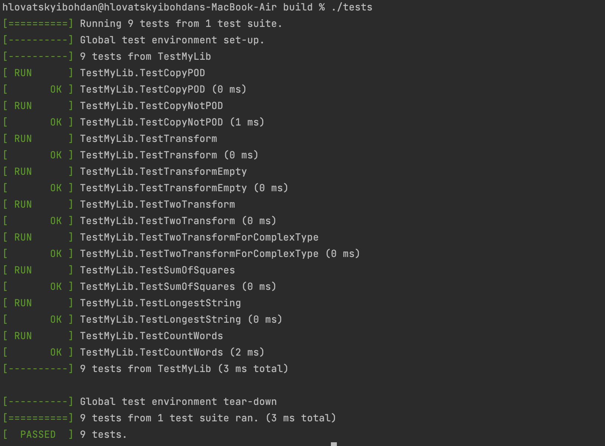

# Lab work <mark>4</mark>: <mark>Algorithms</mark>
Authors (team): <mark>bohdan hlovatskyi: https://github.com/bohdanhlovatskyi</mark><br>

## Prerequisites

- C++17
- GTest to run the tests

### Compilation

```shell
./compile.sh
bin/example

# or direclty via CMakeLists
mdkir build
cd build
cmake .. && make
```

```shell
# to run the tests
cd test
mkdir build
cd build
cmake .. && make
./tests
```

### Important
Everything tested only on MacOS ((. Though sanitizers and PVS-Studio check was conducted.

### Usage

There is example of usage in the **main.cpp** file. More examples are in the tests:
- Sum of squares via map_reduce
- The Longest string ~~on the wild west~~ in the iterator
- Count words in text files given as vector of paths

### Results

Tests do pass!

